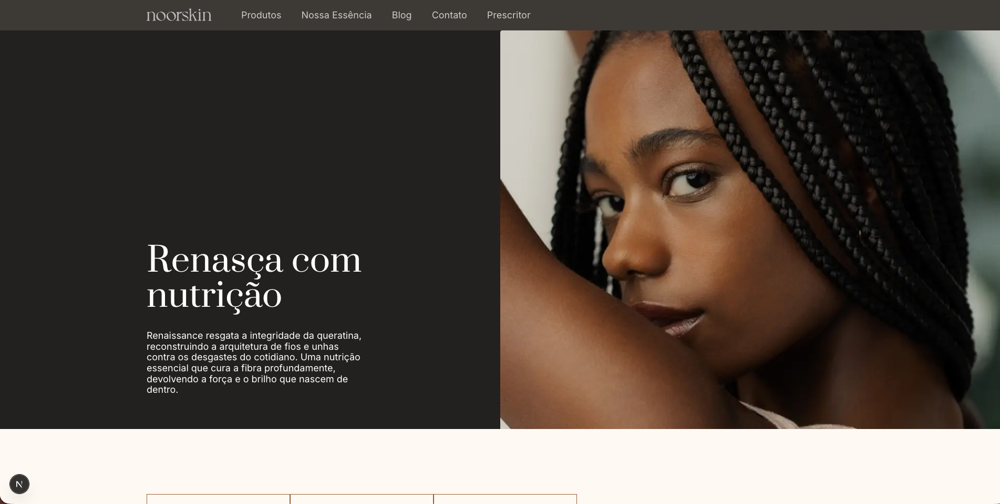
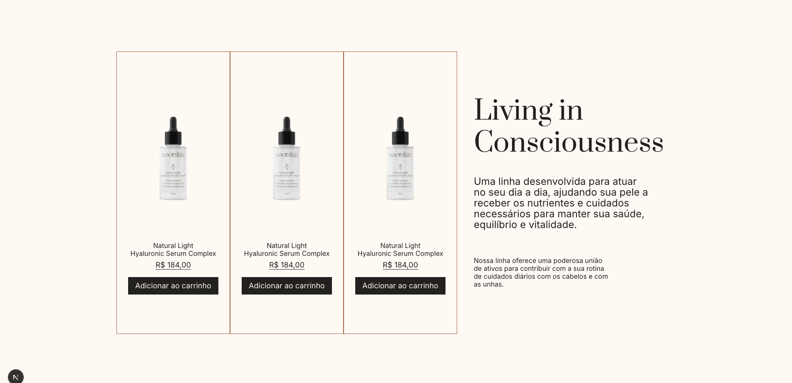
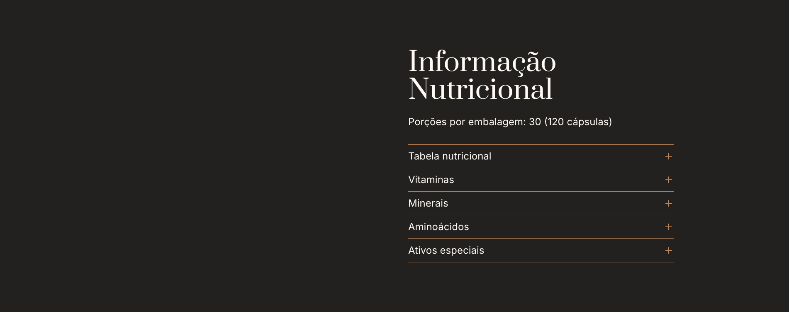
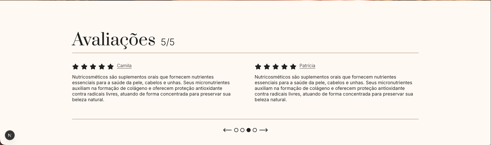

# Projeto Essentia Group

Este é um desafio técnico de site web desenvolvido para apresentar e promover produtos da Essentia de forma elegante e responsiva. O site foi construído com Next.js e Tailwind CSS, oferecendo uma experiência de usuário moderna e intuitiva.

## Funcionalidades

- **Catálogo de Produtos**: Exibição organizada de produtos com cards detalhados, facilitando a navegação.
- **Informações Nutricionais**: Seção dedicada a detalhes nutricionais dos produtos, importante para consumidores conscientes da saúde.
- **Avaliações e Depoimentos**: Área para exibir reviews de clientes, construindo confiança e credibilidade.
- **Design Responsivo**: Layout adaptável para dispositivos móveis, tablets e desktops.
- **Navegação Intuitiva**: Header com menu claro e banner informativo para orientar os usuários.

## Pré-visualização

Aqui estão algumas capturas de tela do site:

### Seção Hero


### Produtos


### Nutrição


### Avaliações


## Como Executar

Para rodar o projeto localmente, siga estes passos:

1. Clone o repositório:
   ```bash
   git clone <url-do-repositorio>
   cd projeto-essencial
   ```

2. Instale as dependências:
   ```bash
   npm install
   ```

3. Execute o servidor de desenvolvimento:
   ```bash
   npm run dev
   ```

4. Abra [http://localhost:3000](http://localhost:3000) no seu navegador para ver o site.

## Tecnologias Utilizadas

- **Next.js**: Framework React para aplicações web.
- **Tailwind CSS**: Framework CSS utilitário para estilização rápida.
- **TypeScript**: Superset do JavaScript para tipagem estática.
- **PostCSS**: Ferramenta para processamento de CSS.